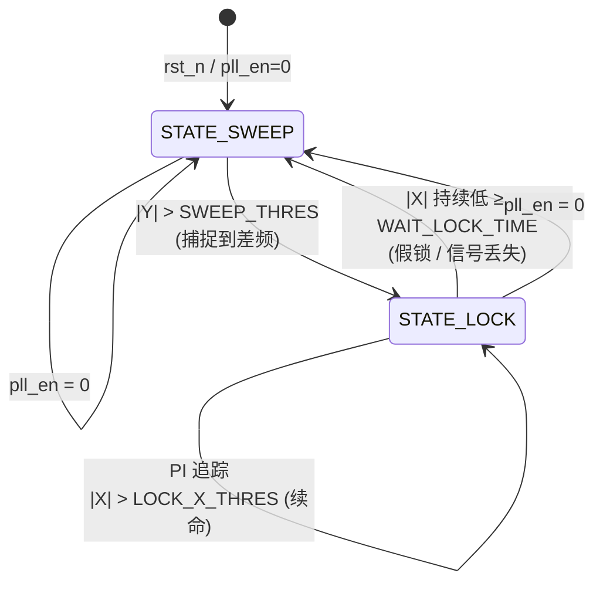

# `pll_controller.v` always 块程序框图

> **文件位置**: `project_1.srcs/sources_1/new/pll_controller.v` (lines 61–129)
> **功能**: 带硬件自动扫频 (Sweep) 的数字 PLL 控制器，由两态状态机 (SWEEP / LOCK) + PI 控制器 + 锁定看门狗 三部分构成
> **触发**: 每个 `clk` 上升沿、或 `rst_n` 下降沿

---

## 一、模块上下文

```
                       ┌──────────────────────────────────────┐
                       │           pll_controller             │
   phase_error_in ───▶ │  ┌──────────┐    ┌──────────────┐    │
   (Y, 相位误差)        │  │ FSM:     │───▶│ PI 控制器    │    │
                       │  │ SWEEP /  │    │ Kp + Ki/2^N  │    │
   amp_in         ───▶ │  │ LOCK     │    └──────────────┘    │
   (X, 幅值)            │  └────┬─────┘           │           │
                       │       ▼                 ▼           │
                       │  ┌─────────┐     ┌─────────────┐    │
                       │  │ 扫频器  │────▶│ center +    │ ──▶ dds_freq_out
                       │  │ ±SWEEP_ │     │ sweep_offset│    │
                       │  │ LIMIT   │     │ + pi_out    │    │
                       │  └─────────┘     └─────────────┘    │
                       └──────────────────────────────────────┘
```

| 输入 | 含义 | 来源 |
|---|---|---|
| `phase_error_in` (Y) | 鉴相误差 ((A/2)·sinΔφ) | `lockin_psd` 的 dc_y |
| `amp_in` (X) | 信号幅值 ((A/2)·cosΔφ) | `lockin_psd` 的 dc_x |
| `valid_in` | PI 节拍 | CIC 输出 valid |
| `pll_en` | 软件使能 | UART |
| `pll_kp / pll_ki` | PI 增益 | UART |
| `center_freq` | 扫频中心 | UART |

| 输出 | 含义 |
|---|---|
| `dds_freq_out` | 给本振 DDS 的频率字 = `center_freq + sweep_offset + pi_out` |
| `is_locked` | 锁定指示 (state == LOCK) |

---

## 二、Mermaid 流程图

```mermaid
flowchart TD
    A([posedge clk OR negedge rst_n]) --> B{rst_n == 0?}

    B -- "是 (异步复位)" --> R[/"复位所有寄存器:<br/>state ← SWEEP<br/>pi_i_reg ← 0<br/>pi_out ← 0<br/>sweep_offset ← 0<br/>sweep_dir ← 0<br/>sweep_timer ← 0<br/>lock_timer ← 0"/]
    R --> END([本拍结束])

    B -- "否" --> C{pll_en == 1?}

    C -- "否 (软关闭)" --> D[/"兜底复位:<br/>state ← SWEEP<br/>pi_i_reg ← 0<br/>pi_out ← 0<br/>(sweep_offset 保持)"/]
    D --> END

    C -- "是" --> E{valid_in == 1?}
    E -- "否" --> END
    E -- "是" --> F{state == ?}

    %% 扫频分支
    F -- "STATE_SWEEP" --> S0[/"清零 PI 与锁定计时:<br/>pi_i_reg ← 0<br/>pi_out ← 0<br/>lock_timer ← 0"/]
    S0 --> S1{abs_y > SWEEP_THRES?}

    S1 -- "是 (捕捉到差频)" --> S2[/"state ← STATE_LOCK"/]
    S2 --> END

    S1 -- "否" --> S3{sweep_timer ≥ SWEEP_INTERVAL?}

    S3 -- "否" --> S4[/"sweep_timer ← sweep_timer + 1"/]
    S4 --> END

    S3 -- "是 (该跳频了)" --> S5[/"sweep_timer ← 0"/]
    S5 --> S6{sweep_dir == 0<br/>(向上扫)?}

    S6 -- "是" --> S7{sweep_offset < SWEEP_LIMIT?}
    S7 -- "是" --> S8[/"sweep_offset ← sweep_offset + SWEEP_STEP"/]
    S7 -- "否 (碰顶)" --> S9[/"sweep_dir ← 1 (掉头向下)"/]

    S6 -- "否 (向下扫)" --> S10{sweep_offset > -SWEEP_LIMIT?}
    S10 -- "是" --> S11[/"sweep_offset ← sweep_offset - SWEEP_STEP"/]
    S10 -- "否 (碰底)" --> S12[/"sweep_dir ← 0 (掉头向上)"/]

    S8 --> END
    S9 --> END
    S11 --> END
    S12 --> END

    %% 锁定分支
    F -- "STATE_LOCK" --> L0[/"PI 闭环更新:<br/>pi_i_reg ← pi_i_reg + phase_error_ext × pll_ki<br/>pi_out ← phase_error_ext × pll_kp + pi_i_reg ▶▶▶ KI_FRAC"/]
    L0 --> L1{lock_timer < WAIT_LOCK_TIME?}

    L1 -- "是 (容忍期内)" --> L2[/"lock_timer ← lock_timer + 1"/]
    L2 --> L3{abs_x > LOCK_X_THRES?}
    L3 -- "是 (信号真在)" --> L4[/"lock_timer ← 0 (续命)"/]
    L3 -- "否" --> L5[/"保持累计的 lock_timer"/]
    L4 --> END
    L5 --> END

    L1 -- "否 (容忍超时)" --> L6[/"state ← STATE_SWEEP<br/>(假锁/信号丢失, 重新搜索)"/]
    L6 --> END

    style R fill:#fdd
    style D fill:#fdd
    style S2 fill:#cfc
    style L6 fill:#fdd
    style L0 fill:#cef
    style S8 fill:#ffc
    style S11 fill:#ffc
```

---

## 三、ASCII 决策树（无 Mermaid 渲染时备用）

```
posedge clk / negedge rst_n
│
├── !rst_n ───────────────► [复位] 全部清零, state=SWEEP                  ─► 出
│
├── pll_en==0 ────────────► [软关] state=SWEEP, PI 清零(扫频偏移保持)      ─► 出
│
└── pll_en==1
    │
    └── valid_in==0 ──────► [无操作] 所有寄存器保持                        ─► 出
        │
        └── valid_in==1
            │
            ├── state == SWEEP ──► [扫频分支]
            │   ├─ pi_i_reg, pi_out, lock_timer 全部清零
            │   │
            │   ├─ |Y| > SWEEP_THRES?
            │   │   ├─ 是 ──────► state ← LOCK                            ─► 出
            │   │   │
            │   │   └─ 否 ──► sweep_timer >= SWEEP_INTERVAL?
            │   │       ├─ 否 ──► sweep_timer++                            ─► 出
            │   │       │
            │   │       └─ 是 ──► sweep_timer ← 0
            │   │           ├─ 向上扫 (sweep_dir=0):
            │   │           │   ├─ offset < +LIMIT  → offset += STEP       ─► 出
            │   │           │   └─ offset >= +LIMIT → sweep_dir ← 1        ─► 出
            │   │           │
            │   │           └─ 向下扫 (sweep_dir=1):
            │   │               ├─ offset > -LIMIT  → offset -= STEP       ─► 出
            │   │               └─ offset <= -LIMIT → sweep_dir ← 0        ─► 出
            │
            └── state == LOCK ───► [锁定分支]
                ├─ PI 更新:
                │   pi_i_reg ← pi_i_reg + (Y_ext × Ki)
                │   pi_out   ← (Y_ext × Kp) + (pi_i_reg >>> KI_FRAC)
                │
                └─ lock_timer < WAIT_LOCK_TIME?
                    ├─ 是 ──► lock_timer++
                    │       ├─ |X| > LOCK_X_THRES → lock_timer ← 0 (续命)  ─► 出
                    │       └─ |X| ≤ LOCK_X_THRES → 累计计时                ─► 出
                    │
                    └─ 否 (超时2s) ──► state ← SWEEP (重新搜索)             ─► 出
```

---

## 四、状态转移图



---

## 五、寄存器更新真值表

| 触发分支              | `state`  | `pi_i_reg / pi_out` | `sweep_offset` | `sweep_dir` | `sweep_timer` | `lock_timer` |
|---|---|---|---|---|---|---|
| **复位** (`!rst_n`)   | SWEEP    | 0                   | 0              | 0           | 0             | 0            |
| **软关** (`pll_en=0`) | SWEEP    | 0                   | 保持           | 保持        | 保持          | 保持         |
| **空拍** (`valid_in=0`) | 保持   | 保持                | 保持           | 保持        | 保持          | 保持         |
| SWEEP — 捕捉到 Y      | → LOCK   | 0                   | 保持           | 保持        | 保持          | 0            |
| SWEEP — 未捕捉, 计时未到 | 保持  | 0                   | 保持           | 保持        | ++            | 0            |
| SWEEP — 跳频(向上)    | 保持     | 0                   | += STEP        | 保持        | 0             | 0            |
| SWEEP — 跳频(向上碰顶) | 保持    | 0                   | 保持           | ← 1         | 0             | 0            |
| SWEEP — 跳频(向下)    | 保持     | 0                   | -= STEP        | 保持        | 0             | 0            |
| SWEEP — 跳频(向下碰底) | 保持    | 0                   | 保持           | ← 0         | 0             | 0            |
| LOCK — X 达标         | 保持     | PI 更新             | 保持           | 保持        | 保持          | 0 (续命)     |
| LOCK — X 未达         | 保持     | PI 更新             | 保持           | 保持        | 保持          | ++           |
| LOCK — 容忍超时       | → SWEEP  | PI 更新             | 保持           | 保持        | 保持          | 保持         |

---

## 六、关键模块图示

### 6.1 状态机两条转移边

```
                         |Y| > SWEEP_THRES
                  ┌──────────────────────────┐
                  │      (捕捉到差频)         │
                  ▼                          │
          ┌─────────────┐             ┌─────────────┐
          │ STATE_SWEEP │ ──────────► │ STATE_LOCK  │
          │ (三角扫频)   │             │ (PI 拉入)   │
          └─────────────┘ ◄────────── └─────────────┘
                  ▲                          │
                  │   |X| 持续低 ≥2s         │
                  └──────────────────────────┘
                         (假锁 / 掉线退回)
```

### 6.2 三角波扫频轨迹

```
sweep_offset
   ▲
   │  +SWEEP_LIMIT ─────────/\─────────────/\──── 碰顶翻向(dir=0→1)
   │                       /  \           /  \
   │                      /    \         /    \
   │                     /      \       /      \
   │  0 ─────────────/─ ─ ─ ─ ─ \─ ─ ─/─ ─ ─ ─ \─ ─ ─ ─ ─ ─►
   │                /            \   /          \           t
   │               /              \ /            \
   │  -SWEEP_LIMIT ─────────────── \/──────────── \──── 碰底翻向(dir=1→0)
   │       (每 SWEEP_INTERVAL 拍走一个 SWEEP_STEP)
```

### 6.3 PI 数据流

```
phase_error_in (28b)            pll_ki (16b)
        │                            │
        ▼                            │
  符号扩展到 64b                     │
        │                            │
        ├────────────► × ◄──────────┘
        │                ▼
        │              (64b)
        │                │
        │                ▼
        │              ┌───┐
        │              │ + │ ◄──── pi_i_reg (Z⁻¹ 反馈)
        │              └─┬─┘
        │                ▼
        │             pi_i_reg
        │                │
        │                ▼  (算术右移 KI_FRAC=16)
        │              >>> 16
        │                │
        │                ▼
        │           ┌────────┐
        │ pll_kp    │  64→48 │
        ├────► × ──►│   +    │──► pi_out (48b) ──► dds_freq_out
        └───────────┴────────┘
```

PI 离散方程：
$$
\begin{aligned}
i[n] &= i[n-1] + K_i \cdot e[n] \\
u[n] &= K_p \cdot e[n] + \frac{i[n-1]}{2^{KI\_FRAC}}
\end{aligned}
$$

其中 `e[n] = phase_error_in`（即 Y 通道，sinΔφ），算术右移 `>>> KI_FRAC` 等效把 Ki 的有效精度放大 2^16 倍。

### 6.4 锁定看门狗（防假锁/掉线）

```
                    每拍 (valid_in=1)
                           │
                           ▼
                    lock_timer < WAIT_LOCK_TIME?
                       /              \
                      是               否(超时)
                      │                 │
                      ▼                 ▼
              lock_timer++       state ← SWEEP
                      │
                      ▼
              |X| > LOCK_X_THRES?
                /          \
               是           否
               │             │
               ▼             ▼
          lock_timer ← 0   累计计时
          (信号在,续命)    (信号弱,临近放弃)
```

> **设计要点**：用 X 而非 Y 做"心跳"，因为锁定后 Y → 0 (PI 的工作目标)，无法判断是真锁还是丢信号；X 在锁定时反而最大 (cos(0)=1)，是最直接的"信号是否存在"指示。

---

## 七、参数对照表

| 参数 | 默认值 | 物理含义 | 调试要点 |
|---|---|---|---|
| `KI_FRAC` | 16 | 积分项右移位数（小数化） | 越大积分越平稳但越慢 |
| `SWEEP_STEP` | 48'd43303 | 每跳 ≈ 10 Hz (65 MHz 时钟) | 太大会跳过捕捉带 |
| `SWEEP_LIMIT` | 48'd433038425 | ±10 kHz 扫频范围 | 输入偏离超过此值抓不到 |
| `SWEEP_INTERVAL` | 16'd500 | 每 500 拍跳一次频 | 必须慢于 LPF 建立时间 |
| `SWEEP_THRES` | 28'd5000 (顶层覆盖为 800k) | Y 捕捉阈值 | 一直扫不锁 → 调小 |
| `LOCK_X_THRES` | 28'd8000 (顶层覆盖为 3M) | X 锁定维持阈值 | 刚锁就掉 → 调小 |
| `WAIT_LOCK_TIME` | 32'd2_000_000 | ≈2s 容忍期 | 假锁/瞬态扰动判定窗 |

---

## 八、最终输出合成（组合电路）

```verilog
assign dds_freq_out = center_freq + sweep_offset + pi_out;
assign is_locked    = (state == STATE_LOCK);
```

```
center_freq (48b, UART 设)  ──┐
                              │
sweep_offset (48b, 粗调 ±10kHz)─┼──► + ──► dds_freq_out (48b) ──► 本振 DDS
                              │
pi_out      (48b, 微调)      ──┘

state == LOCK ──► is_locked  (1b, 锁定 LED / 上报上位机)
```

**分层频率合成**：
1. `center_freq`：基准（粗），UART 给定
2. `sweep_offset`：硬件扫频（中），±10 kHz 范围
3. `pi_out`：PI 微调（细），实时跟踪相位误差
4. 锁定后 `sweep_offset` 冻结，由 `pi_out` 接管追踪

---

## 九、整段代码的高度概括

> **always 块 = 异步复位 + 同步两态 FSM + 6 个寄存器更新规则**
> - **触发**：每个 clk 上升沿、或 rst_n 下降沿。
> - **优先级**：复位 > pll_en 兜底 > valid_in 节拍 > 状态分支。
> - **SWEEP 分支**：监听 `|Y|` 触发跳态；否则三角波递推 `sweep_offset`，PI 持续清零。
> - **LOCK 分支**：执行 PI 更新 + `|X|` 看门狗，超时退回 SWEEP。
> - **输出**：寄存器 `pi_out`、`sweep_offset`、`state` 经组合电路合成 `dds_freq_out` 与 `is_locked`。

---

## 十、调试建议

| 现象 | 可能原因 | 应该调整 |
|---|---|---|
| 一直扫频不锁 | Y 阈值太高 / 输入信号太弱 | 调小 `SWEEP_THRES` |
| 偶尔锁住马上掉 | X 阈值太高 / 容忍期太短 | 调小 `LOCK_X_THRES` 或加大 `WAIT_LOCK_TIME` |
| 锁定后抖动大 | Kp/Ki 太大 | 调小 UART 传来的 `pll_kp`/`pll_ki` |
| 收敛慢 | Ki 太小 / KI_FRAC 太大 | 减小 KI_FRAC 或增大 ki |
| 扫频过快漏过捕获 | `SWEEP_INTERVAL` 太小 | 加大该值 |

---

*文档生成日期: 2026-04-30*
*对应代码: `project_1.srcs/sources_1/new/pll_controller.v` (137 lines)*
